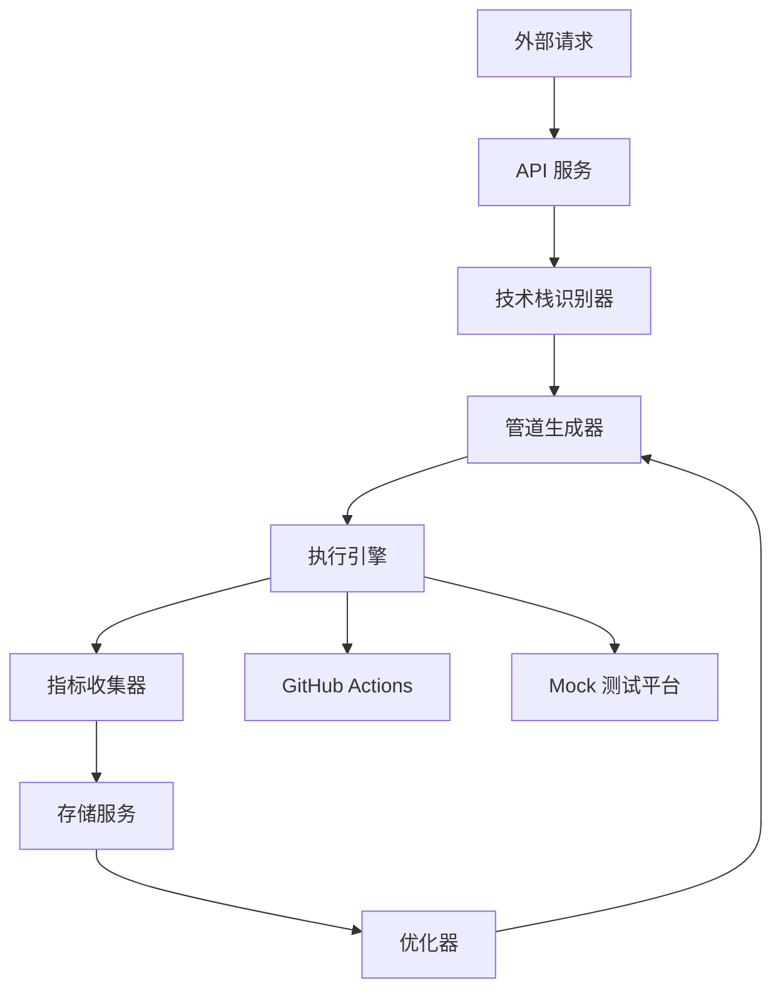

# 智能 CI/CD 管道编排器设计文档

## 1. 系统概述

### 1.1 系统名称
智能 CI/CD 管道编排器 (Smart CI/CD Pipeline Orchestrator)

### 1.2 系统目标
开发一个轻量级的智能 CI/CD 管道编排系统，能够根据项目特性自动生成、执行和优化 CI/CD 流程，提高开发效率和部署质量。

### 1.3 核心价值
- **自动化**: 减少手动配置和干预，提高开发效率
- **智能优化**: 根据历史数据自动优化管道配置，提高构建和部署速度
- **技术栈自适应**: 自动识别项目技术栈，生成适合的管道配置
- **可扩展性**: 支持多种 CI/CD 平台和自定义扩展

## 2. 系统架构

### 2.1 整体架构
系统采用分层架构设计，包括：

1. **接口层**: 提供 RESTful API 接口，接收外部请求
2. **业务逻辑层**: 实现核心业务逻辑，包括技术栈识别、管道生成、执行控制等
3. **执行层**: 负责实际执行 CI/CD 管道任务
4. **存储层**: 存储项目信息、管道配置、执行历史和优化数据

### 2.2 核心组件

| 组件 | 功能描述 | 所属层次 |
|------|---------|----------|
| 技术栈识别器 | 分析项目结构，识别使用的技术栈 | 业务逻辑层 |
| 管道生成器 | 根据技术栈生成 CI/CD 管道配置 | 业务逻辑层 |
| 执行引擎 | 执行 CI/CD 管道任务 | 执行层 |
| 指标收集器 | 收集管道执行指标 | 执行层 |
| 优化器 | 根据历史数据优化管道配置 | 业务逻辑层 |
| 存储服务 | 存储项目信息、配置和历史数据 | 存储层 |
| API 服务 | 提供 RESTful API 接口 | 接口层 |

### 2.3 数据流

## 3. 详细模块设计

### 3.1 技术栈识别模块

#### 3.1.1 功能描述
- 分析项目目录结构
- 识别项目使用的编程语言、框架和工具
- 检测依赖管理文件和配置文件
- 生成技术栈报告

#### 3.1.2 实现细节
- **文件扫描器**: 递归扫描项目目录，识别关键文件
- **技术栈检测器**: 根据文件特征识别技术栈
- **依赖分析器**: 分析依赖管理文件，提取依赖信息
- **技术栈报告生成器**: 生成结构化的技术栈报告

#### 3.1.3 支持的技术栈
- **编程语言**: Java, Python, JavaScript, TypeScript, Go, Rust, C++, C#
- **前端框架**: React, Vue, Angular, Svelte
- **后端框架**: Spring, Django, Express, NestJS, FastAPI, Gin
- **构建工具**: Maven, Gradle, npm, yarn, pnpm, pip, go mod, cargo
- **测试框架**: JUnit, pytest, Jest, Mocha, Vitest

### 3.2 CI/CD 管道配置生成模块

#### 3.2.1 功能描述
- 根据技术栈报告生成适合的 CI/CD 管道配置
- 支持多种 CI/CD 平台的配置格式
- 提供配置模板管理
- 验证生成的配置有效性

#### 3.2.2 实现细节
- **模板管理器**: 管理不同技术栈和平台的配置模板
- **配置生成器**: 根据技术栈和项目需求生成配置
- **配置验证器**: 验证生成的配置是否有效
- **平台适配器**: 适配不同 CI/CD 平台的配置格式

#### 3.2.3 支持的 CI/CD 平台
- Mock（测试用）

### 3.3 管道执行和指标收集模块

#### 3.3.1 功能描述
- 执行 CI/CD 管道任务
- 监控执行状态和进度
- 收集执行指标和日志
- 存储执行历史数据

#### 3.3.2 实现细节
- **执行引擎**: 负责启动和管理管道执行
- **任务调度器**: 调度和协调管道中的各个任务
- **指标收集器**: 收集执行时间、资源使用等指标
- **日志管理器**: 收集和存储执行日志
- **状态跟踪器**: 跟踪管道执行状态和进度

#### 3.3.3 收集的指标
- 执行时间（总时间、各阶段时间）
- 成功/失败率
- 资源使用情况（CPU、内存）
- 测试覆盖率
- 构建大小
- 部署时间

### 3.4 管道优化模块

#### 3.4.1 功能描述
- 分析历史执行数据
- 识别管道中的瓶颈和优化机会
- 生成优化建议

#### 3.4.2 实现细节
- **数据分析器**: 分析历史执行数据
- **优化建议生成器**: 根据分析结果生成优化建议

## 4. API 接口规范

### 4.1 基础路径
`/api/v1`

### 4.2 核心接口

#### 4.2.1 项目管理

| 接口 | 方法 | 路径 | 功能描述 |
|------|------|------|----------|
| 创建项目 | POST | `/projects` | 创建新的项目记录 |
| 获取项目列表 | GET | `/projects` | 获取所有项目列表 |
| 获取项目详情 | GET | `/projects/{id}` | 获取项目详细信息 |
| 更新项目 | PUT | `/projects/{id}` | 更新项目信息 |
| 删除项目 | DELETE | `/projects/{id}` | 删除项目 |

#### 4.2.2 技术栈分析

| 接口 | 方法 | 路径 | 功能描述 |
|------|------|------|----------|
| 分析项目 | POST | `/projects/{id}/analyze` | 分析项目技术栈 |
| 获取分析结果 | GET | `/projects/{id}/tech-stack` | 获取技术栈分析结果 |

#### 4.2.3 管道配置

| 接口 | 方法 | 路径 | 功能描述 |
|------|------|------|----------|
| 生成配置 | POST | `/projects/{id}/generate-pipeline` | 生成 CI/CD 管道配置 |
| 获取配置 | GET | `/projects/{id}/pipeline` | 获取管道配置 |
| 更新配置 | PUT | `/projects/{id}/pipeline` | 更新管道配置 |

#### 4.2.4 管道执行

| 接口 | 方法 | 路径 | 功能描述 |
|------|------|------|----------|
| 执行管道 | POST | `/projects/{id}/execute` | 执行 CI/CD 管道 |
| 获取执行状态 | GET | `/projects/{id}/executions/{executionId}` | 获取管道执行状态 |
| 获取执行历史 | GET | `/projects/{id}/executions` | 获取管道执行历史 |

#### 4.2.5 优化管理

| 接口 | 方法 | 路径 | 功能描述 |
|------|------|------|----------|
| 分析优化 | POST | `/projects/{id}/analyze-optimization` | 分析管道优化机会 |
| 获取优化建议 | GET | `/projects/{id}/optimization-suggestions` | 获取优化建议 |
| 应用优化 | POST | `/projects/{id}/apply-optimization` | 应用优化建议 |

## 5. 技术选型

### 5.1 后端技术

| 分类 | 技术 | 版本 | 选型理由 |
|------|------|------|----------|
| 语言 | Golang | 1.20+ | 编译型语言，性能优异，生态成熟，适合高并发后端服务 |
| 框架 | 标准库 + 轻量路由 | - | 减少依赖，保持轻量，便于维护 |
| 数据库 | SQLite | 3.35+ | 轻量级，无需单独部署，适合原型和小型应用 |

### 5.2 前端技术

| 分类 | 技术 | 版本 | 选型理由 |
|------|------|------|----------|
| 语言 | JavaScript | ES6+ | 广泛使用，学习曲线平缓 |
| 框架 | Vue | 3.0+ | 轻量级，响应式数据绑定，组件化开发，生态丰富 |
| UI 库 | Element Plus | 2.0+ | 美观易用，组件丰富，与 Vue 3 完美集成 |
| HTTP 客户端 | Axios | 1.0+ | 功能丰富，支持拦截器和取消请求 |

### 5.3 工具和依赖

| 分类 | 工具/依赖 | 版本 | 用途 |
|------|-----------|------|------|
| 代码分析 | 自定义解析器 | - | 轻量级代码文件解析，识别语法结构 |
| YAML 处理 | gopkg.in/yaml.v3 | - | 处理 YAML 配置文件 |
| JSON 处理 | encoding/json | - | 标准库 JSON 处理 |
| 测试框架 | testing | - | Go 标准库测试框架 |

## 6. 实现计划

### 6.1 开发阶段

1. **阶段一: 核心功能实现**
   - 技术栈识别模块
   - 管道配置生成模块
   - 基础 API 接口

2. **阶段二: 执行和监控**
   - 管道执行引擎
   - 指标收集模块
   - 执行历史存储

3. **阶段三: 智能优化**
   - 数据分析模块
   - 优化建议生成
   - 配置自动更新

4. **阶段四: 前端界面**
   - 项目管理界面
   - 管道配置界面
   - 执行监控界面
   - 优化分析界面

### 6.2 部署计划

- **开发环境**: 本地开发，使用 Docker 容器化
- **测试环境**: 独立的测试服务器，模拟生产环境
- **生产环境**: 容器化部署，支持水平扩展

### 6.3 集成计划

- 与 GitHub 代码托管平台集成
- 与 GitHub Actions CI/CD 平台集成
- 与监控和告警系统集成
