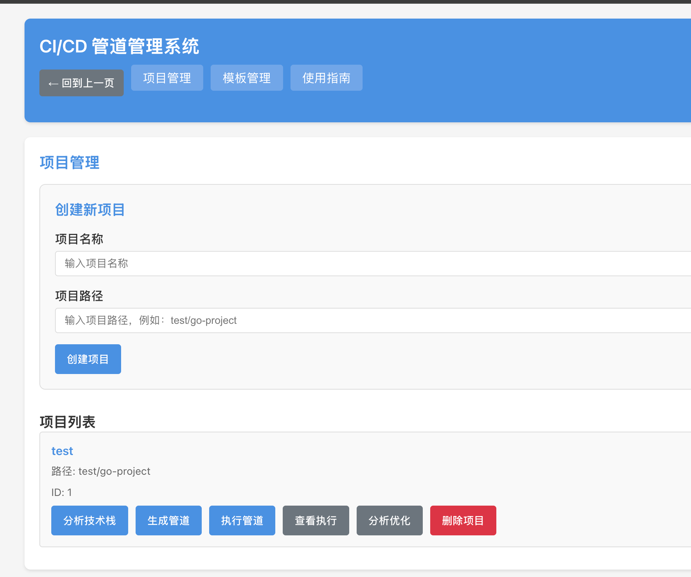
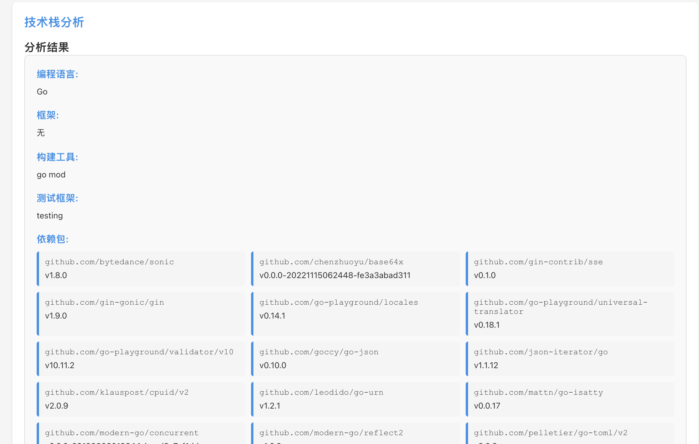
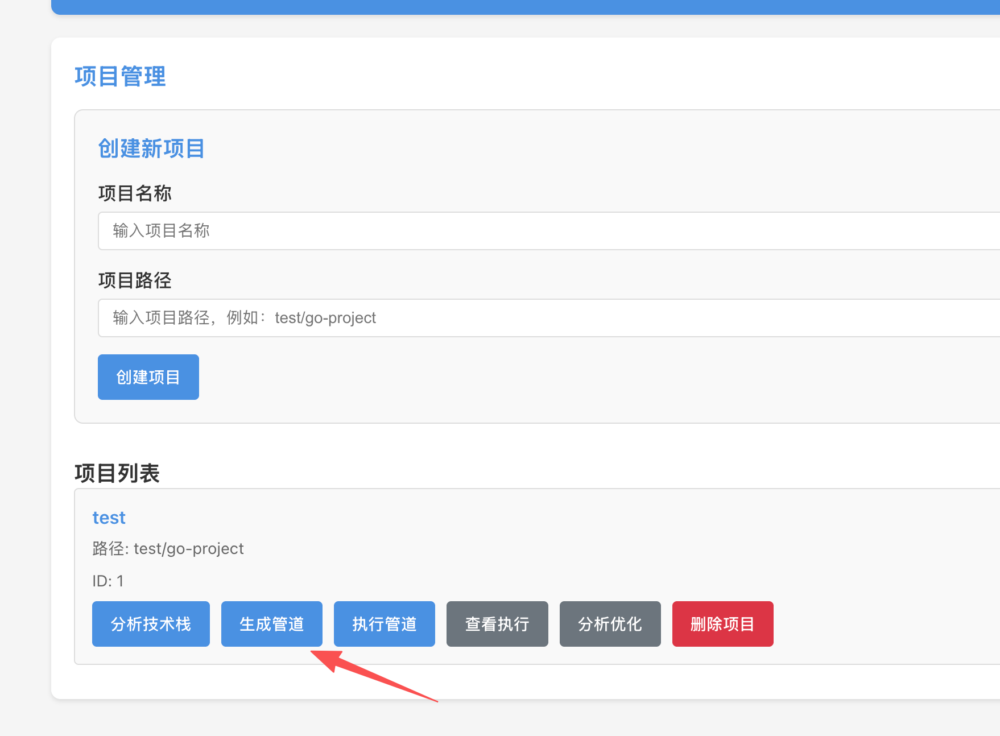
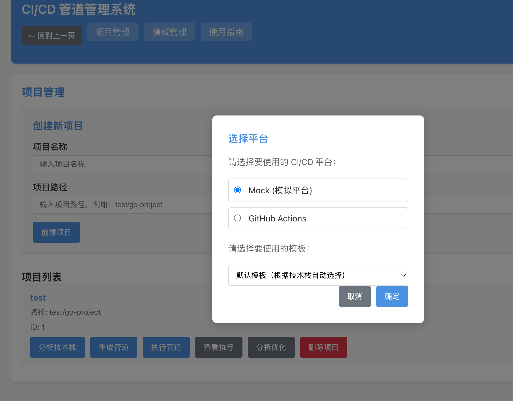
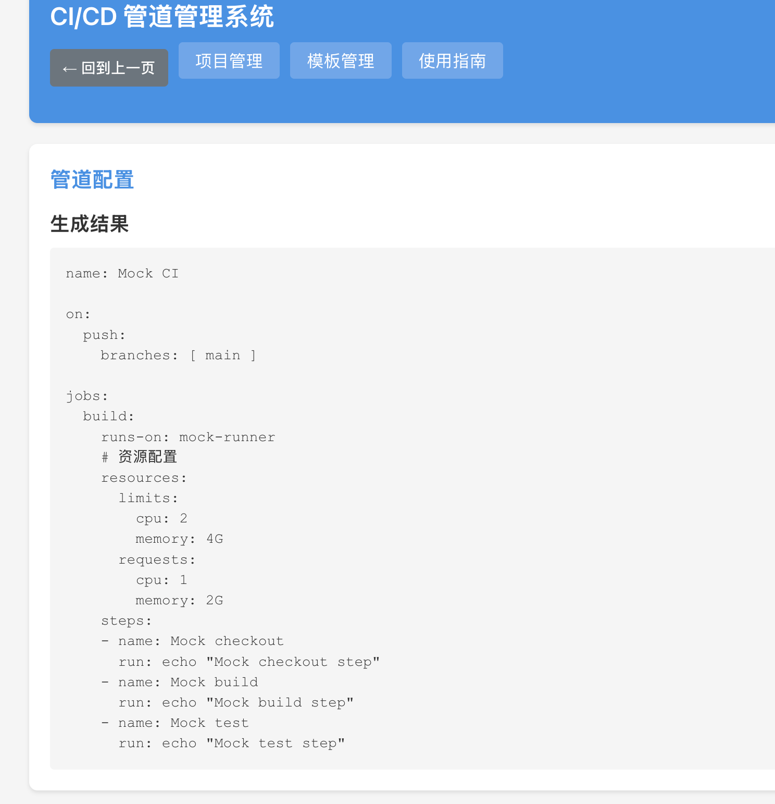
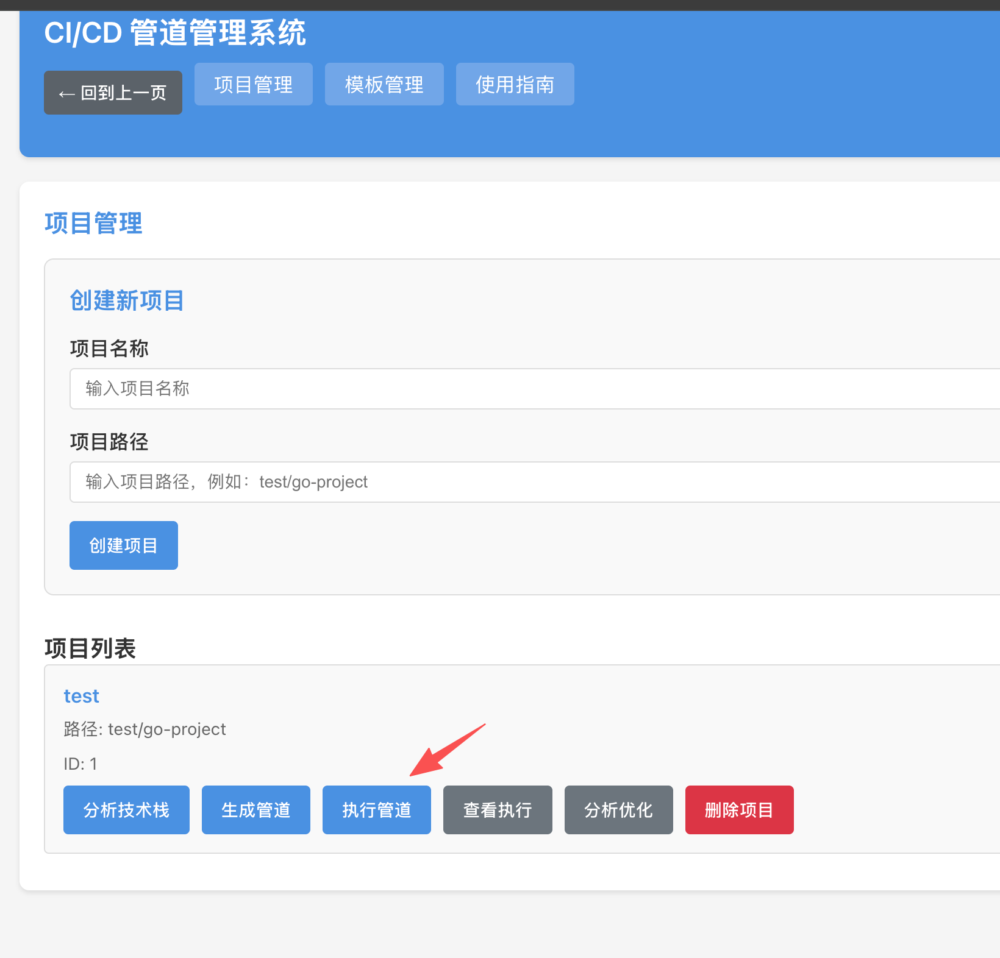
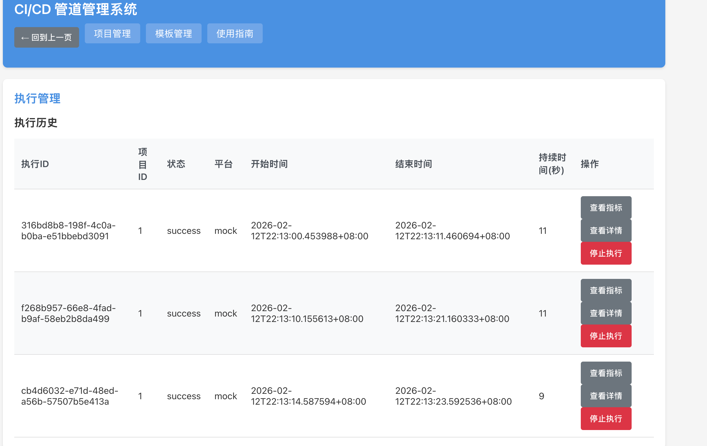
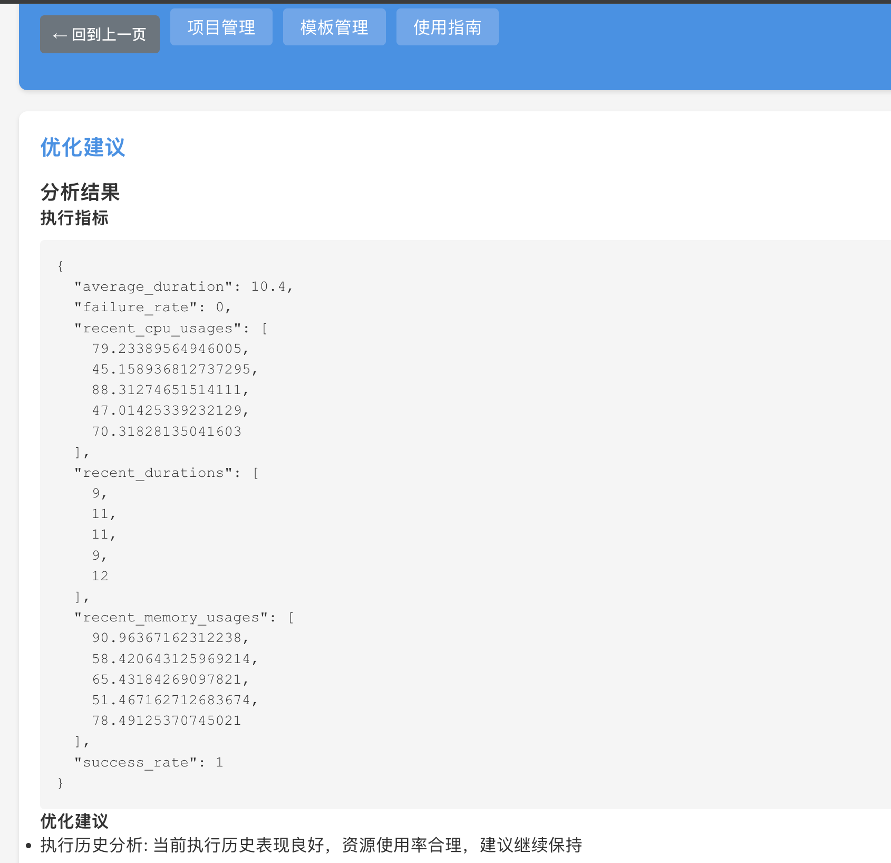
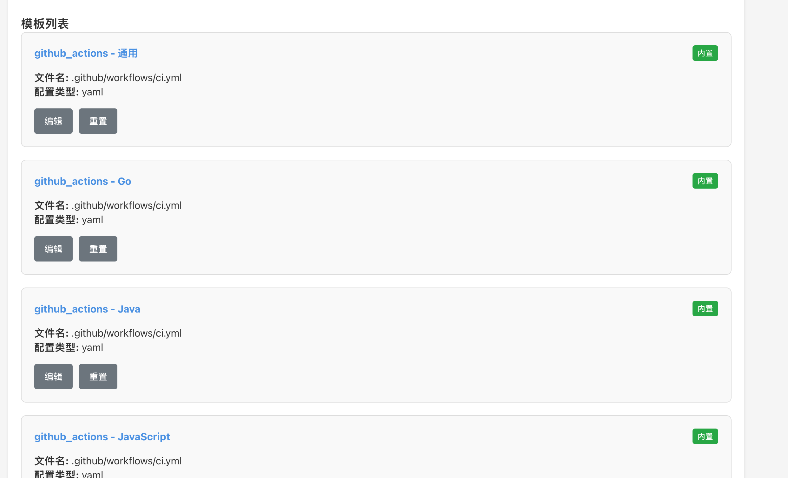
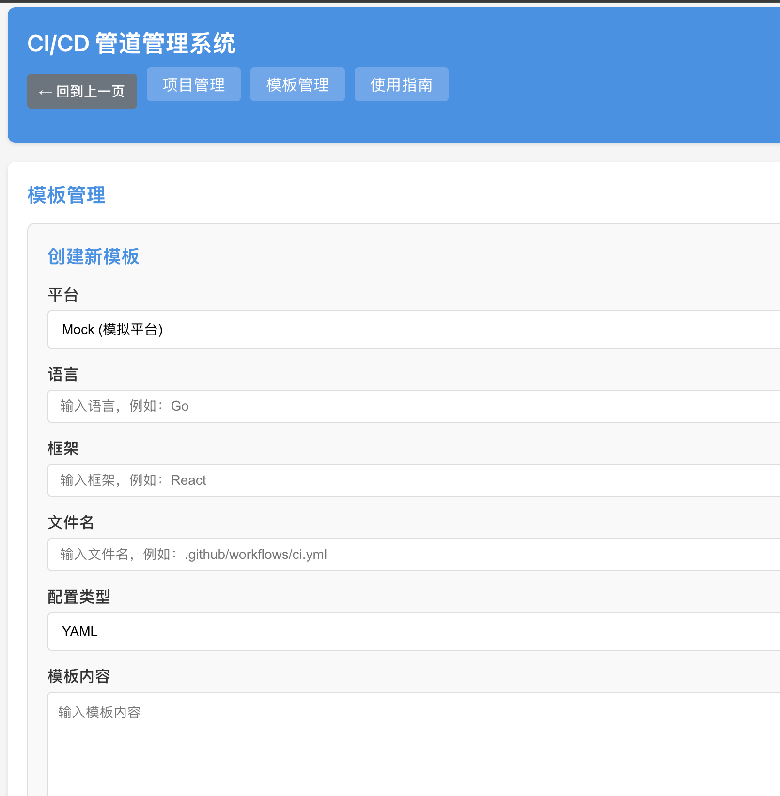

# 前端使用指南

本文档详细说明了 CI/CD 管道管理系统前端的使用流程和功能操作，帮助用户快速上手系统。

## 访问前端

前端服务默认运行在 `http://localhost:3000/`，在浏览器中打开该地址即可访问系统。

## 导航栏

前端页面顶部有一个导航栏，包含以下功能：

- **回到上一页**：点击左侧的返回按钮，可以回到上一个页面
- **项目管理**：点击进入项目管理页面
- **模板管理**：点击进入模板管理页面
- **使用指南**：点击进入使用指南页面

## 项目管理

### 创建项目

1. 在前端界面的"项目管理"页面，找到"创建新项目"部分
2. 填写项目名称和项目路径
3. 点击"创建项目"按钮
4. 系统会创建项目并显示在项目列表中

### 分析技术栈

1. 在项目列表中，找到要分析的项目
2. 点击"分析技术栈"按钮
3. 系统会自动识别项目的技术栈
4. 分析完成后，系统会显示详细的技术栈分析结果，包括：
   - 编程语言
   - 框架
   - 构建工具
   - 测试框架
   - 依赖包

### 生成管道配置

1. 在项目列表中，找到要生成配置的项目
2. 点击"生成管道"按钮
3. 在弹出的对话框中，选择平台（GitHub Actions 或 Mock）
4. 选择要使用的模板：
   - 默认模板：根据项目技术栈自动选择最匹配的模板
   - 内置模板：系统预设的模板，适用于常见的技术栈
   - 自定义模板：用户创建的模板，适用于特定项目的需求
5. 点击"确定"按钮
6. 系统会根据技术栈和选择的模板生成配置文件
7. 配置文件会保存在项目目录的对应路径中

### 执行管道

1. 在项目列表中，找到要执行的项目
2. 点击"执行管道"按钮
3. 在弹出的对话框中，选择平台（GitHub Actions 或 Mock）
4. 点击"确定"按钮
5. 系统会执行 CI/CD 管道
6. 执行完成后，系统会显示执行结果和指标

### 查看执行历史

1. 在项目列表中，找到要查看的项目
2. 点击"查看执行"按钮
3. 系统会显示该项目的执行历史
4. 点击具体的执行记录，可以查看执行详情和日志

### 分析优化建议

1. 在项目列表中，找到要分析的项目
2. 点击"分析优化"按钮
3. 系统会分析执行数据，生成优化建议
4. 分析完成后，系统会显示优化建议列表

## 模板管理

### 查看模板列表

1. 在前端界面的"模板管理"页面，系统会显示所有模板
2. 模板分为内置模板和自定义模板

### 创建模板

1. 在"模板管理"页面，找到"创建新模板"部分
2. 填写模板信息：
   - 平台：选择 GitHub Actions 或 Mock
   - 语言：填写项目的编程语言
   - 框架：填写项目使用的框架
   - 文件名：填写配置文件的路径
   - 配置类型：选择 YAML 或 JSON
   - 内容：填写模板的具体内容
3. 点击"创建模板"按钮
4. 系统会创建模板并显示在模板列表中

### 编辑模板

1. 在模板列表中，找到要编辑的模板
2. 点击"编辑"按钮
3. 修改模板信息
4. 点击"更新模板"按钮
5. 系统会更新模板信息

### 删除模板

1. 在模板列表中，找到要删除的模板
2. 点击"删除"按钮
3. 确认删除操作
4. 系统会删除模板

### 重置内置模板

1. 在模板列表中，找到要重置的内置模板
2. 点击"重置"按钮
3. 系统会将模板恢复到默认状态

## 使用指南

在"使用指南"页面，系统会显示详细的使用说明，包括：

- 系统概述
- 功能说明
- 操作流程
- 常见问题

## 注意事项

1. **GitHub Actions 平台**：现阶段只实现生成 ci.yaml 功能，其他功能还未实现
2. **Mock 平台**：用于测试和开发，可以模拟完整的 CI/CD 管道执行过程
3. **项目路径**：项目路径需要是相对路径，例如：test/go-project
4. **技术栈分析**：系统会自动识别项目的技术栈，无需手动配置
5. **模板选择**：生成管道配置时，可以选择适合的模板，也可以使用默认模板